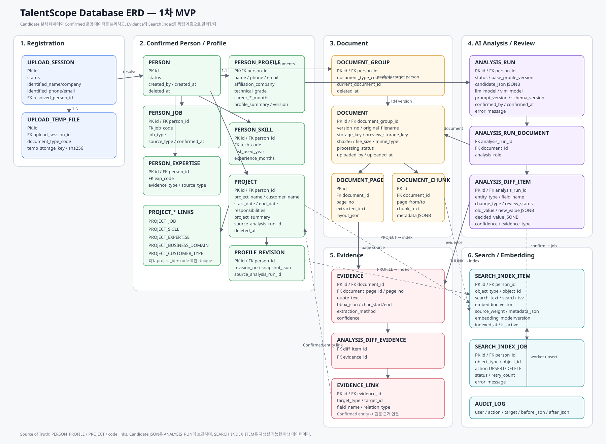

# 12. Database ERD & Core Table Structure

## 1. 목적

본 문서는 TalentScope 1차 MVP의 데이터 모델을 정의한다.

핵심 업무 흐름은 다음과 같다.

```text
문서 업로드
  → 신규/기존 인력 식별
  → 원본문서 저장
  → Parser/VLM/LLM 분석
  → Candidate Profile 생성
  → 기존 Confirmed Profile 비교
  → 사용자 검토·확정
  → Profile/Project DB 반영
  → Evidence 연결
  → Search Index / Embedding 생성
  → 조건검색·Keyword·Vector Hybrid Search
```

가장 중요한 설계 원칙은 **AI Candidate 데이터와 사용자가 확정한 운영 데이터를 분리하는 것**이다.

- `ANALYSIS_RUN.candidate_json`: AI가 만든 임시 Candidate 데이터
- `PERSON_PROFILE`, `PROJECT`, 각 코드 연결 테이블: 사용자 확정 후 사용하는 Source of Truth
- `EVIDENCE`: 값의 출처가 되는 문서/페이지/문구
- `SEARCH_INDEX_ITEM`: 검색 성능을 위해 재생성할 수 있는 파생 데이터

## 2. ERD



원본 SVG: [`docs/assets/12_database_erd.svg`](assets/12_database_erd.svg)

## 3. 데이터 계층

```text
[Registration]
UPLOAD_SESSION
UPLOAD_TEMP_FILE
      ↓
[Confirmed Person]
PERSON
PERSON_PROFILE
PERSON_JOB / PERSON_SKILL / PERSON_EXPERTISE
PROJECT + PROJECT_* LINKS
      ↑
[AI Candidate]
ANALYSIS_RUN
ANALYSIS_DIFF_ITEM
      ↑
[Document]
DOCUMENT_GROUP → DOCUMENT → DOCUMENT_PAGE / DOCUMENT_CHUNK
      ↓
[Evidence]
EVIDENCE → ANALYSIS_DIFF_EVIDENCE → EVIDENCE_LINK
      ↓
[Search]
SEARCH_INDEX_JOB → SEARCH_INDEX_ITEM
```

## 4. 등록 및 인력 식별

### 4.1 `upload_session`

신규 인력 등록 과정에서 아직 Person이 확정되지 않은 상태를 관리한다.

| 컬럼 | 설명 |
|---|---|
| `id` | PK |
| `status` | `UPLOADING / IDENTIFIED / RESOLVED / CANCELLED` |
| `identified_name` | 문서에서 우선 추출한 이름 |
| `identified_company` | 소속 |
| `identified_phone` | 연락처 |
| `identified_email` | 이메일 |
| `duplicate_result_json` | 기존 인력 후보 및 비교결과 |
| `resolved_person_id` | 최종 연결된 Person FK |
| `created_by` | 등록 사용자 FK |
| `created_at` | 생성일 |
| `expires_at` | 임시 업로드 만료 시각 |

### 4.2 `upload_temp_file`

정식 Document로 확정되기 전 임시 업로드 파일이다.

| 컬럼 | 설명 |
|---|---|
| `id` | PK |
| `upload_session_id` | FK |
| `document_type_code` | 문서종류 |
| `original_filename` | 원본 파일명 |
| `temp_storage_key` | 임시 Object Storage Key |
| `mime_type` | MIME Type |
| `file_size` | 파일크기 |
| `sha256` | 중복 파일 검사용 Hash |
| `validation_status` | `VALID / INVALID / ENCRYPTED` |
| `created_at` | 업로드일 |

신규 또는 기존 인력 연결이 확정되면 정식 `document` 데이터로 승격한다.

## 5. 인력 및 확정 프로필

### 5.1 `person`

사람 자체를 나타내는 식별 Entity이다. Profile의 실제 속성은 `person_profile`에 둔다.

| 컬럼 | 설명 |
|---|---|
| `id` | PK |
| `status` | `ACTIVE / INACTIVE / ARCHIVED / DELETED` |
| `created_by` | 최초 등록자 |
| `created_at` | 등록일 |
| `updated_at` | 수정일 |
| `deleted_at` | Soft Delete |

### 5.2 `person_profile`

현재 사용 중인 확정 Profile의 대표값이다.

| 컬럼 | 설명 |
|---|---|
| `person_id` | PK/FK |
| `name` | 이름 |
| `birth_year` | 선택 |
| `phone` | 연락처 |
| `email` | 이메일 |
| `address_region` | 거주지역(광역 수준) |
| `affiliation_company` | 소속 |
| `department` | 부서 |
| `current_title` | 직위/직급 |
| `employment_type` | 고용형태 |
| `technical_grade` | 기술등급 |
| `career_start_date` | 최초 경력일 |
| `career_calculated_months` | 시스템 계산 경력 |
| `career_confirmed_months` | 사용자 확정 경력 |
| `profile_summary` | 확정 경력요약 |
| `profile_version` | Profile Revision |
| `profile_updated_at` | 최종 갱신일 |

주민등록번호, 계좌번호, 신분증번호 등 인력검색에 불필요한 민감정보는 구조화하지 않는다.

## 6. 공통 코드체계

### `code_master`

`JOB / TECH / EXP / BIZ / CUSTOMER_TYPE / DOC_TYPE`을 공통 Master 구조로 관리한다.

| 컬럼 | 설명 |
|---|---|
| `code` | PK. 예: `JOB-AI-DEV` |
| `code_type` | 코드 분류 |
| `parent_code` | 상위코드 FK |
| `name` | 표준명 |
| `description` | 설명 |
| `sort_order` | 표시순서 |
| `is_active` | 활성여부 |

### `code_alias`

표준코드와 검색·분석용 별칭을 연결한다.

```text
AI Engineer / AI Developer / 인공지능개발자
→ JOB-AI-DEV
```

주요 컬럼: `id`, `code`, `alias`, `normalized_alias`, `language`.

## 7. 인력 직무·기술·전문분야

### `person_job`

- `person_id`
- `job_code`
- `job_type`: `PRIMARY / SECONDARY / EXPERIENCE`
- `source_type`: `USER / AI_CONFIRMED / MIGRATION`
- `sort_order`
- `confirmed_at`

권장 Unique: `(person_id, job_code, job_type)`.

### `person_skill`

- `person_id`
- `tech_code`
- `last_used_year`
- `experience_months` (명시 또는 사용자 확정값이 있을 경우)
- `is_representative`
- `source_type`
- `confirmed_at`

AI가 임의로 숙련도 상/중/하를 확정하는 컬럼은 MVP에서 두지 않는다.

### `person_expertise`

- `person_id`
- `exp_code`
- `evidence_type`: `EXPLICIT / INFERRED`
- `source_type`
- `confirmed_at`

## 8. 프로젝트 경력

### 8.1 `project`

프로젝트는 TalentScope 검색과 추천근거의 핵심 Entity다.

| 컬럼 | 설명 |
|---|---|
| `id` | PK |
| `person_id` | 인력 FK |
| `project_name` | 프로젝트명 |
| `customer_name` | 고객명 |
| `start_date` | 시작일 |
| `end_date` | 종료일 |
| `duration_months` | 수행기간 |
| `responsibilities` | 담당업무 |
| `project_summary` | 프로젝트 요약 |
| `source_type` | `AI_CONFIRMED / USER / MIGRATION` |
| `source_analysis_run_id` | 최초 생성 Analysis FK |
| `created_at`, `updated_at` | 이력 |
| `deleted_at` | Soft Delete |

### 8.2 프로젝트 N:M 코드 연결

- `project_job(project_id, job_code)`
- `project_skill(project_id, tech_code)`
- `project_expertise(project_id, exp_code, evidence_type)`
- `project_business_domain(project_id, biz_code)`
- `project_customer_type(project_id, customer_type_code)`

각 테이블은 `(project_id, code)` 복합 Unique를 둔다.

Person 수준 BIZ/CUSTOMER_TYPE 경험은 프로젝트로부터 View 또는 Materialized View로 집계하는 것을 원칙으로 한다.

## 9. 기타 경력 데이터

### `employment_history`

회사별 재직기간, 직위, 부서, 담당업무를 관리한다.

### `education`

학교, 전공, 학위, 기간, 졸업상태를 관리한다.

### `certification`

자격명, 발급기관, 취득일, 만료일을 관리한다. 자격번호는 필요할 때만 제한적으로 저장한다.

## 10. 문서 및 버전관리

### 10.1 `document_group`

동일 성격 문서의 논리 Group이다.

```text
홍길동 이력서
 ├ v1
 ├ v2
 └ v3 (current)
```

주요 컬럼: `id`, `person_id`, `document_type_code`, `title`, `current_document_id`, `created_at`, `deleted_at`.

### 10.2 `document`

실제 파일 Version 메타정보를 관리한다.

| 컬럼 | 설명 |
|---|---|
| `id` | PK |
| `document_group_id` | FK |
| `version_no` | 버전 |
| `original_filename` | 원본명 |
| `extension`, `mime_type`, `file_size` | 파일정보 |
| `storage_key` | 원본 Object Storage Key |
| `preview_storage_key` | 변환 Preview Key |
| `sha256` | 중복검사 |
| `processing_status` | `UPLOADED / PROCESSING / READY / FAILED` |
| `uploaded_by`, `uploaded_at` | 등록정보 |
| `deleted_at` | Soft Delete |

원본 파일은 PostgreSQL BLOB이 아니라 MinIO/S3 호환 File/Object Storage 사용을 전제로 한다.

### 10.3 `document_page`

페이지 기반 Evidence 및 Viewer 이동을 위해 페이지 단위 분석결과를 관리한다.

- `document_id`
- `page_no`
- `extracted_text`
- `layout_json`
- `extraction_method`

### 10.4 `document_chunk`

Keyword/Vector 검색용 문서 Chunk이다.

- `document_id`
- `chunk_index`
- `page_from`, `page_to`
- `chunk_text`
- `token_count`
- `chunk_hash`
- `metadata JSONB`

## 11. AI 분석 및 검토

### 11.1 `analysis_run`

한 번의 AI Profile 분석 실행을 나타낸다.

| 컬럼 | 설명 |
|---|---|
| `id` | PK |
| `person_id` | 대상 인력 FK |
| `status` | `QUEUED / PROCESSING / REVIEWING / CONFIRMED / FAILED` |
| `candidate_json` | AI 전체 Candidate JSONB |
| `base_profile_version` | 비교 대상 Profile 버전 |
| `llm_model`, `vlm_model` | 사용 모델 |
| `prompt_version` | Prompt 버전 |
| `schema_version` | Candidate Schema 버전 |
| `overall_confidence` | 참고값 |
| `started_at`, `completed_at` | 실행일 |
| `confirmed_by`, `confirmed_at` | 확정정보 |
| `error_message` | 실패정보 |

MVP에서는 Candidate의 모든 하위 Entity를 별도 정규화하지 않고 `candidate_json + analysis_diff_item` 구조를 사용한다.

### 11.2 `analysis_run_document`

한 Analysis에서 참조한 여러 문서를 연결한다.

- `analysis_run_id`
- `document_id`
- `analysis_role`

### 11.3 `analysis_diff_item`

AI 분석 결과와 Confirmed DB를 비교한 검토 단위다.

| 컬럼 | 설명 |
|---|---|
| `analysis_run_id` | FK |
| `entity_type` | `PROFILE / JOB / TECH / EXP / PROJECT / CERT ...` |
| `candidate_path` | Candidate JSON 경로 |
| `existing_target_id` | 기존 Entity ID |
| `field_name` | 비교 Field |
| `change_type` | `SAME / NEW / UPDATE / CONFLICT / REVIEW` |
| `old_value` | 기존값 JSONB |
| `new_value` | 신규값 JSONB |
| `confidence` | AI Confidence |
| `evidence_type` | `EXPLICIT / INFERRED` |
| `review_status` | `PENDING / ACCEPTED / REJECTED / MODIFIED / MERGED` |
| `decided_value` | 사용자 결정값 JSONB |
| `decided_by`, `decided_at` | 검토자/검토일 |

프로젝트 병합도 `existing_target_id + review_status=MERGED` 방식으로 처리하여 별도 Workflow Table을 추가하지 않는다.

## 12. Evidence 구조

### 12.1 `evidence`

문서의 어느 위치가 특정 값의 근거인지 저장한다.

- `document_id`
- `document_page_id`
- `page_no`
- `quote_text`
- `bbox_json`
- `char_start`, `char_end`
- `extraction_method`
- `confidence`

### 12.2 `analysis_diff_evidence`

AI 검토항목과 하나 이상의 Evidence를 N:M으로 연결한다.

```text
RAG 신규 추출
 ├ 이력서 p.3
 ├ 경력기술서 p.8
 └ 경력기술서 p.11
```

### 12.3 `evidence_link`

확정 후에도 근거를 바로 따라갈 수 있도록 운영 Entity와 Evidence를 연결한다.

- `evidence_id`
- `target_type`
- `target_id`
- `field_name`
- `relation_type`

`target_type` 예: `PERSON_PROFILE`, `PERSON_JOB`, `PERSON_SKILL`, `PERSON_EXPERTISE`, `PROJECT`, `PROJECT_SKILL`, `CERTIFICATION`.

이를 통해 다음 Drill-down이 가능하다.

```text
검색결과 홍길동
 → RAG 경험
 → ○○기관 AI 프로젝트
 → 경력기술서 v3 p.8
```

## 13. Profile Revision 및 Audit

### `profile_revision`

AI 확정 또는 직접수정 시 확정 Profile Snapshot을 남긴다.

- `person_id`
- `revision_no`
- `snapshot_json`
- `source_type`
- `source_analysis_run_id`
- `created_by`, `created_at`

### `audit_log`

주요 변경·문서 다운로드 등의 행위를 기록한다.

- `user_id`
- `action_type`
- `target_type`, `target_id`
- `before_json`, `after_json`
- `created_at`

## 14. 검색 및 Embedding

### 14.1 `search_index_item`

검색을 위해 재생성 가능한 파생 Index다.

| 컬럼 | 설명 |
|---|---|
| `id` | PK |
| `person_id` | 검색결과 병합 기준 |
| `object_type` | `PROFILE / PROJECT / DOCUMENT_CHUNK` |
| `object_id` | 원본 Entity ID |
| `search_text` | 검색용 Text |
| `search_tsv` | PostgreSQL Full Text Search |
| `embedding` | pgvector Vector |
| `source_weight` | 근거 유형 가중치 |
| `metadata_json` | 검색 Metadata |
| `embedding_model`, `embedding_version` | 재색인 관리 |
| `is_active`, `indexed_at` | 상태 |

검색 신뢰도 우선순위는 다음과 같이 둔다.

```text
Confirmed Profile
  > Confirmed Project
  > Original Document Chunk
```

Vector Score 자체를 최종 적합도로 사용하지 않고 Backend Ranking에서 구조화 조건, Project 근거, Keyword, Semantic Score를 조합한다.

### 14.2 `search_index_job`

Profile 확정 Transaction과 Embedding 생성을 분리하기 위한 비동기 Queue다.

- `person_id`
- `object_type`, `object_id`
- `action`: `UPSERT / DELETE`
- `status`: `PENDING / PROCESSING / COMPLETED / FAILED`
- `retry_count`
- `error_message`
- `created_at`, `completed_at`

```text
Profile DB Commit
  → SEARCH_INDEX_JOB 생성
  → Worker
  → Embedding 생성
  → SEARCH_INDEX_ITEM 갱신
```

Embedding Runtime 장애가 Profile 확정 Transaction 자체를 실패시키지 않도록 분리한다.

## 15. AI 분석 확정 Transaction

`확정 및 Profile 반영` 시 논리적 처리 순서는 다음과 같다.

```text
BEGIN
  1. analysis_run lock
  2. 미처리 CONFLICT / REVIEW 확인
  3. ACCEPTED / MODIFIED 결과 적용
  4. person_profile 갱신
  5. person_job / person_skill / person_expertise 갱신
  6. project 생성·수정·병합
  7. education / certification 갱신
  8. evidence_link 생성
  9. profile_revision 생성
 10. analysis_run = CONFIRMED
 11. audit_log 기록
 12. search_index_job 생성
COMMIT

Worker
  → search text 생성
  → embedding 생성
  → search_index_item UPSERT
```

## 16. 핵심 Index 권장

- `person_profile(name)`
- `person_profile(email)`, `person_profile(phone)`
- `person_profile(technical_grade)`
- `person_job(job_code, person_id)`
- `person_skill(tech_code, person_id)`
- `person_expertise(exp_code, person_id)`
- `project(person_id, start_date)`
- `project(customer_name)`
- `project_skill(tech_code, project_id)`
- `document(sha256)`
- `analysis_run(status, created_at)`
- `analysis_diff_item(analysis_run_id, review_status)`
- `search_index_item`의 `search_tsv` GIN Index
- `search_index_item.embedding`의 pgvector HNSW 또는 IVFFlat Index
- `search_index_item(person_id, object_type)`

이름·고객명·프로젝트명 유사검색에는 `pg_trgm` 사용을 검토한다.

## 17. 삭제 및 보존 정책

`person`, `project`, `document`, `document_group`은 기본적으로 `deleted_at` 기반 Soft Delete를 적용한다.

`upload_temp_file` 등 임시 데이터는 만료 후 물리삭제할 수 있다.

원본문서는 버전별로 보존하고 최신 문서가 이전 문서의 확정 경력을 자동 삭제하지 않는다.

## 18. 핵심 테이블 목록

| 영역 | 테이블 |
|---|---|
| 사용자 | `app_user` |
| 등록 | `upload_session`, `upload_temp_file` |
| 인력 | `person`, `person_profile` |
| 코드 | `code_master`, `code_alias` |
| 역량 | `person_job`, `person_skill`, `person_expertise` |
| 프로젝트 | `project`, `project_job`, `project_skill`, `project_expertise`, `project_business_domain`, `project_customer_type` |
| 기타경력 | `employment_history`, `education`, `certification` |
| 문서 | `document_group`, `document`, `document_page`, `document_chunk` |
| AI | `analysis_run`, `analysis_run_document`, `analysis_diff_item` |
| 근거 | `evidence`, `analysis_diff_evidence`, `evidence_link` |
| 이력 | `profile_revision`, `audit_log` |
| 검색 | `search_index_item`, `search_index_job` |

## 19. 구현 시 고정할 핵심 원칙

1. Candidate 데이터는 `analysis_run.candidate_json`과 Diff 영역에 두고 Confirmed DB와 분리한다.
2. 사용자 확정 Profile/Project만 구조화 검색의 Source of Truth로 사용한다.
3. Evidence는 독립 Entity로 관리하여 Profile/Project/원본문서 사이의 추적성을 확보한다.
4. `search_index_item`은 언제든 재생성 가능한 파생 데이터로 취급한다.
5. Embedding 생성은 Profile 확정 Transaction과 분리하여 비동기로 처리한다.
6. 파일 Binary는 DB에 저장하지 않고 Object Storage에 보존한다.

## 20. 향후 Docker / Traefik 배포 설계 고려사항

DB 설계 자체와는 별개지만 이후 구현·배포 설계에서는 **Traefik Label 기반 Docker 배포 환경**을 전제로 한다.

현재 단계에서 다음 제약을 미리 유지한다.

```text
Internet / 사내 사용자
        ↓
     Traefik
        ↓ labels 기반 routing
  ┌─────┴────────────┐
Frontend           Backend API
                     │
              ┌──────┼─────────┐
              │      │         │
          PostgreSQL Worker   Object Storage
            +pgvector  │        (MinIO/S3)
                       │
                    ALZI LLM/VLM Runtime
```

향후 배포 문서에서 구체화할 항목:

- Frontend/Backend Docker Service 분리
- Traefik `routers / services / middlewares` Label 정책
- HTTPS/TLS 및 Domain Routing
- Backend만 DB/Object Storage/LLM·VLM에 접근하도록 Network 분리
- PostgreSQL/MinIO Persistent Volume 및 Backup
- AI 분석/Embedding Worker의 별도 Container 구성
- Runtime Endpoint 및 DB Password 등 Secret/Environment 관리
- Health Check 및 Container Restart 정책
- 개발/운영 Compose 분리 또는 Override 전략

**Frontend가 LLM/VLM Runtime에 직접 접근하지 않고 Backend를 통해서만 호출한다는 기존 원칙은 Docker/Traefik 배포에서도 유지한다.**

본 내용은 향후 `Docker Compose + Traefik` 배포 아키텍처 설계 시 상세화한다.

## 21. 다음 설계 단계

다음 단계에서는 본 ERD를 기준으로 다음을 구체화한다.

- PostgreSQL 실제 DDL 초안
- PK/FK/Unique/Check Constraint
- pgvector 및 FTS Index 정의
- Backend API Resource 구조
- AI Analysis Worker / Search Index Worker 처리방식
- Docker Compose 및 Traefik Label 기반 배포 아키텍처
